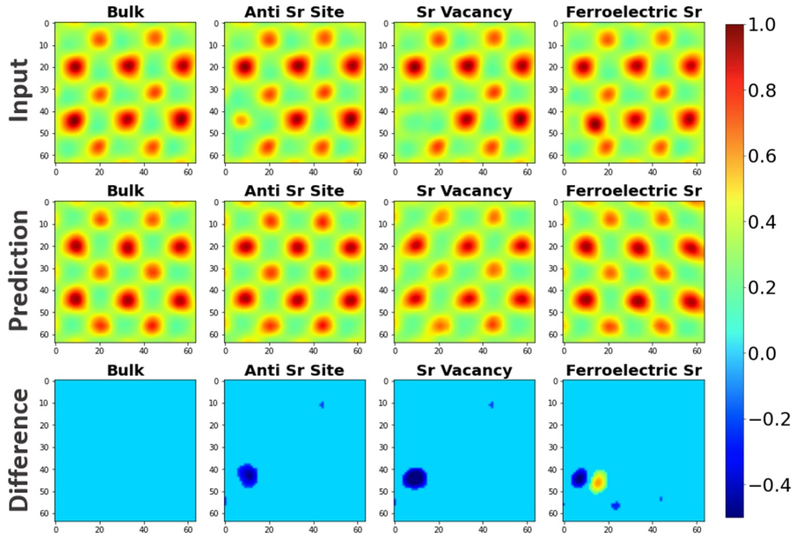

# CVAE for Anomaly Detection in STEM Images

[](https://onlinelibrary.wiley.com/doi/full/10.1002/smll.202205977)

## Overview
This repository contains the code for a Convolutional Variational Autoencoder (CVAE) designed to detect structural anomalies and point defects in Scanning Transmission Electron Microscopy (STEM) images. 

The model relies on an unsupervised learning approach. By training the CVAE to reconstruct "perfect" or bulk crystal lattices, it subsequently fails to accurately reconstruct defects. The difference between the input image and the CVAE prediction highlights the anomalies.


*Figure: The CVAE pipeline demonstrating anomaly isolation. The difference between the input STEM image and the model's prediction reveals structural defects like Sr Vacancies and Anti-Sr sites.*

## Repository Structure
* `CVAE_training.py` / `.ipynb`: Scripts used to train the Convolutional Variational Autoencoder on bulk lattice datasets.
* `CVAE_testing.py` / `.ipynb`: Evaluation scripts to test the trained model on images containing defects, generating difference maps.
* `analysis_example.py` / `.ipynb`: A comprehensive pipeline combining training, testing, and plotting the final results.
* `requirements.txt`: Required Python dependencies.

## Installation
You can run these models either locally or via Google Colab. 

**Local Setup:**
```bash
# Clone the repository
git clone [https://github.com/Enea77/CVAE-Anomaly-Detection.git](https://github.com/Enea77/CVAE-Anomaly-Detection.git)
cd CVAE-Anomaly-Detection

# Install dependencies
pip install -r requirements.txt
```

## Usage
To see the model in action and generate your own difference maps:

```bash
# Run the full analysis pipeline
python analysis_example.py
```
*Running this script will output a set of matplotlib figures showing the input crystal lattice, the CVAE prediction, and the resulting difference heatmaps used to isolate defects.*
